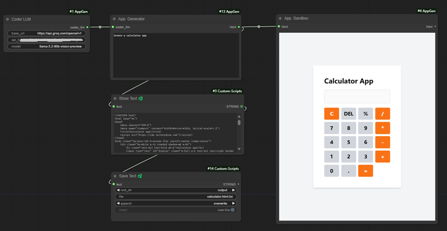
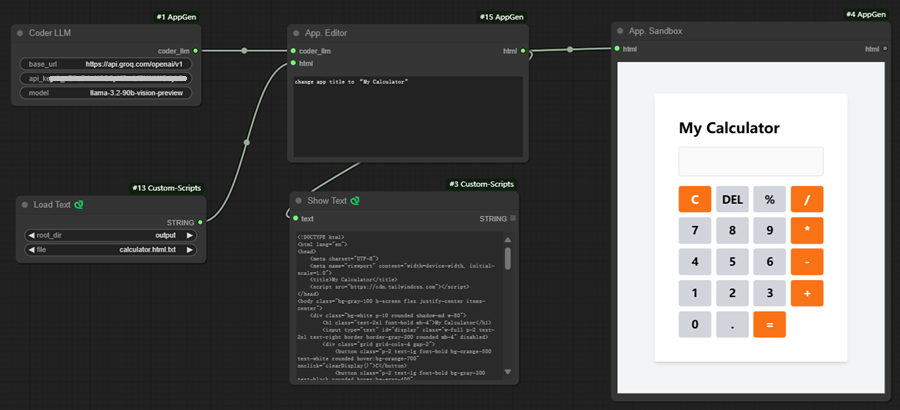

# ComfyUI-AppGen

ComfyUI-AppGen is a ComfyUI node pack designed to generate and edit Single Page Applications (SPAs) using natural language. Inspired by groq-appgen from GroqLabs, this tool leverages the power of Large Language Models (LLMs) to simplify web development workflows.

## Features

- Natural Language to Code: Generate and edit SPAs using simple natural language queries.
- Flexible LLM Integration: Compatible with any LLM that supports the OpenAI API.
- Sandbox Environment: Test generated SPAs in a secure sandbox.
- Seamless Editing: Modify existing SPAs with natural language feedback.

## Getting Started

Install ComfyUI-AppGen:

- Clone this repository or download the nodes.
- Add the nodes to your ComfyUI workflow.
- Configure LLM:
  - Set up your preferred LLM (e.g., Groq, DeepSeek) with OpenAI API compatibility.
- Generate and Edit SPAs:
  - Use the AppGen node to create SPAs from natural language queries.
  - Use the AppEdit node to modify existing SPAs with feedback.
  - Test your SPAs in the AppSandbox environment.

## Custom Nodes

### 1. CoderLLM

A customizable LLM client that acts as a coder. It can generate code based on natural language prompts. It works with any LLM that supports the OpenAI API.

Tested Models:
- Groq: llama-3.3-70b-specdec
- DeepSeek: DeepSeek-V3 MoE

It yields highly accurate and efficient results on tested models.

### 2. AppGen

Generates a Single Page Application (SPA) from a natural language query and outputs the source code as a single HTML file.

Example:
- Query: "Generate a calculator app."
- Output: A fully functional calculator app in a single HTML file.

### 3. AppEdit

Modifies an existing SPA based on natural language feedback.

Example:
- Feedback: "Change the app title to 'My Calculator'."
- Output: Updated SPA with the new title.

### 4. AppSandbox

Provides a secure sandbox environment to run and test generated SPAs.

## Sample Workflows

### 1. App Generation 


- Query: "Generate a calculator app."
- Node:  `AppGen`
- Output: A fully functional calculator app in a single HTML file.



### 2. App Edit


- Feedback: "Change the app title to 'My Calculator'."
- Node: `AppEdit`
- Output: Updated calculator app with the new title.



## Query Examples

- calculator

```
Create a calculator app with a clean modern design. Include basic arithmetic operations (add, subtract, multiply, divide) and a clear button. The calculator should support decimal numbers and display the current calculation.
```

- Note Taker

```
Build a note-taking app with a clean, minimal interface. Include a title field and content area for each note. Add the ability to create new notes and preview existing ones in a side panel. Make sure the input fields have specified text colors consistent with the selected theme. Storing notes should be done correctly. Each note should be a separate entry in the object storage.
```

- Weather App

```
Design a weather dashboard that shows the current temperature, weather condition, and other metrics like humidity and wind speed. Use weather-appropriate icons and a clean, modern layout with good visual hierarchy.
```

- Snake Game

```
Develop a classic snake game with arrow key controls. Include a score counter, game over screen, and restart button. The snake should grow when eating food, and the game should end if the snake hits the walls or itself. Make sure it is correct and make the JS implementation simple. The spawning algorithm should spawn within the bounds.
```

- Image Gallery

```
Design a responsive image gallery with a grid layout. Include image thumbnails that expand to full size when clicked. Add smooth transitions and a lightbox effect for viewing images.
```

- Quiz App

```
Create an interactive quiz application with multiple-choice questions. Include a progress indicator, score tracking, and immediate feedback on answers. Make it visually engaging with appropriate spacing and transitions between questions.
```

- Kanban Board

```
Create a Kanban board with 'To Do', 'In Progress', and 'Done' columns. Include an 'Add Task' button (select which board), task cards with titles and descriptions, and drag-and-drop functionality. Use a clean, responsive design with pastel colors and subtle animations. Make it feature complete. Allow dragging between columns. Use in-browser React rendering using Babel. Make sure the input fields have explicit colors set that are compatible with the theme. Use HTML5 native features for drag-and-drop, verify it works correctly. Populate with some SWE examples.
```

- Video Player

```
Build a video player with standard controls (play/pause, volume, fullscreen). Include a progress bar with preview thumbnails and playback speed controls. Add a clean, minimal interface that fades when not in use.
```

- Expense Tracker

```
Build an expense tracking app with the ability to add transactions with amounts and categories. Show total balance and category-wise breakdown. Include a simple chart to visualize spending patterns.Make sure the input fields have explicit colors set that are compatible with the theme.
```

- Calender

```
Design a monthly calendar view with the ability to navigate between months. Show current date highlight and different styling for weekend days. Include a simple event display system.
```

## Contributing

We welcome contributions! If you'd like to improve ComfyUI-AppGen, please:

- Fork the repository.
- Create a new branch for your feature or bug fix.
- Submit a pull request with a detailed description of your changes.

## Credits

- [groq-appgen](https://github.com/groq/groq-appgen): An interactive web application that generates and modifies web applications using Groq's LLM API. 
